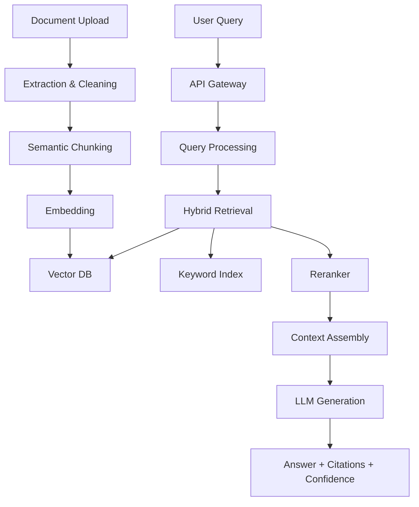

# 🚀 RAG Knowledge Assistant: Enterprise-Grade AI System

[](https://www.python.org/downloads/)
[](https://fastapi.tiangolo.com/)
[](https://opensource.org/licenses/MIT)
[](https://www.docker.com/)
[](https://kubernetes.io/)

> **An advanced Retrieval-Augmented Generation (RAG) system that I built to demonstrate enterprise-scale AI engineering capabilities, combining cutting-edge language models with intelligent document retrieval for accurate, contextual, and transparent AI responses.**
**IntelliRAG is a practical, production-ready Retrieval-Augmented Generation (RAG) system that delivers accurate, source-grounded answers from private and public documents using modern LLMs and vector search. It ingests documents, breaks them into semantically meaningful chunks, embeds those chunks in a vector database, retrieves the most relevant passages for a query, and generates concise answers with citations and confidence indicators.**

---

## What the project does
- Ingests multi-format content (PDF, DOCX, TXT, MD, HTML), extracts, cleans, and semantically chunks it.
- Builds dense vector indices with modern embeddings; supports semantic, keyword, and hybrid retrieval.
- Reranks candidates (e.g., cross-encoder) to improve precision before answer generation.
- Generates answers grounded in retrieved context with citations, optional streaming, and confidence scoring.
- Provides monitoring hooks (latency, confidence, retrieval quality) and deployment scaffolding for small teams and enterprise operations.

## Why it's useful
- Reduces hallucination by grounding answers in trusted sources.
- Keeps knowledge current without retraining—update documents, reindex, and go.
- Improves discoverability and productivity across research, engineering, and support.
- Adds transparency: every response cites its sources and reports a confidence score.

## Key features
- Document pipeline: extraction, cleaning, semantic chunking, embedding, vector indexing.
- Retrieval: semantic, keyword (BM25), and hybrid search with Reciprocal Rank Fusion (RRF) and reranking.
- Generation: multi-LLM provider support, streamed or complete answers, citations and confidence scoring.
- Monitoring and evaluation: performance and quality metrics, dashboards, alerts, and evaluation hooks.
- Security and operations: JWT auth, RBAC scaffolding, rate limiting, audit logging, Docker/Kubernetes-ready.

---

## My journey building IntelliRAG

This project reflects a learning and engineering path developed during the MSc in Data Science at the University of Glasgow. The programme's blend of computing foundations, machine learning, information retrieval, and a substantial project component provided the theoretical and practical grounding to design and ship a real system. Through lectures, labs, and project-based modules, core skills formed the backbone of this work: data engineering, IR and retrievers, deep learning, software architecture, and evaluation.

Curiosity was the catalyst. Large language models are transformative, yet they can hallucinate and fall behind real-world changes. Retrieval-Augmented Generation (RAG) is a pragmatic pattern: let LLMs reason, but retrieve truth from trusted, up-to-date sources. Building IntelliRAG was the opportunity to move from theory to production-quality software—making deliberate design choices about chunking, indexing, hybrid retrieval, reranking, prompt construction, evaluation, and monitoring.

What this taught and reinforced:
- How to structure a FastAPI codebase for clarity and scale.
- How chunking and hybrid retrieval trade precision and recall.
- How to surface the quality and performance metrics stakeholders actually need.
- How to package, test, and deploy with CI/CD and container orchestration.
- How to design for reliability, observability, and ongoing improvement.

IntelliRAG is both a working system and a capstone artifact—evidence of translating MSc learning outcomes into robust, maintainable, and deployable AI software.

---

## Architecture overview

- Ingestion: Multi-format text extraction → cleaning → semantic chunking.
- Embeddings: Batch encode chunks → store vectors in FAISS/Pinecone/Weaviate.
- Retrieval: Semantic + keyword retrieval → RRF fusion → cross-encoder reranking.
- Generation: Assemble context → LLM answer → cite sources → estimate confidence.
- Monitoring: Track latency, confidence, retrieval quality; dashboards and alerts.
- Deployment: Docker images; Kubernetes manifests for scale, resilience, and rollout.

Example diagram (GitHub supports Mermaid in Markdown):


---

## Getting started

### Prerequisites
- Python 3.11+
- LLM provider key (e.g., OpenAI) and optionally a vector DB key (e.g., Pinecone, or local FAISS)
- Docker (optional but recommended for reproducibility)

### Quickstart
1. Clone the repository:
   ```bash
   git clone https://github.com/AmaldevJkumar/IntelliRAG-Adaptive-Knowledge-Assistant.git
   cd IntelliRAG-Adaptive-Knowledge-Assistant
   ```

2. Set up environment:
   ```bash
   cp .env.example .env
   # Edit .env and add your API keys
   ```

3. Install dependencies:
   ```bash
   pip install -r requirements.txt
   ```

4. Run the server:
   ```bash
   uvicorn backend.app.main:app --reload --host 0.0.0.0 --port 8000
   ```

5. Visit http://localhost:8000/docs for interactive API exploration.

### Docker setup
```bash
docker-compose up --build
```

### Suggested project structure
```
IntelliRAG-Adaptive-Knowledge-Assistant/
├── backend/app/              # FastAPI application
│   ├── api/                  # API routes
│   ├── services/             # Business logic
│   ├── models/               # Data models
│   └── utils/                # Utilities
├── deployment/
│   ├── kubernetes/           # K8s manifests
│   └── monitoring/           # Observability configs
├── tests/                    # Test suites
├── data/sample_documents/    # Sample knowledge base
├── notebooks/                # Analysis notebooks
├── scripts/                  # Utility scripts
├── .github/workflows/        # CI/CD pipelines
└── README.md
```

---

## Usage examples

### Query via API
```bash
curl -X POST "http://localhost:8000/api/v1/query" \
  -H "Content-Type: application/json" \
  -d '{
    "query": "What are the benefits of RAG systems?",
    "top_k": 5,
    "query_type": "hybrid",
    "include_sources": true
  }'
```

### Python client
```python
import requests

# Query the system
response = requests.post(
    "http://localhost:8000/api/v1/query",
    json={
        "query": "Explain machine learning fundamentals",
        "top_k": 3,
        "confidence_threshold": 0.8,
        "include_sources": True
    }
)

result = response.json()
print(f"Answer: {result['answer']}")
print(f"Sources: {[doc['filename'] for doc in result['retrieved_documents']]}")
print(f"Confidence: {result['confidence_score']:.3f}")
```

### Document upload
```bash
curl -X POST "http://localhost:8000/api/v1/documents/upload" \
  -F "file=@your-document.pdf" \
  -F "source=research_papers" \
  -F 'metadata={"category":"AI/ML"}'
```

---

## Development workflow

### Running tests
```bash
# All tests
python -m pytest tests/ -v

# With coverage
python -m pytest tests/ --cov=backend/app --cov-report=html

# Specific test types
python -m pytest tests/test_unit/ -v      # Unit tests
python -m pytest tests/test_api.py -v     # API tests
```

### Code quality
```bash
# Format code
black backend/
isort backend/

# Lint
flake8 backend/

# Type checking
mypy backend/app
```

---

## Key components

### Document Processing Pipeline
- **Text Extraction**: Multi-format support (PDF, DOCX, HTML, etc.)
- **Cleaning**: Remove noise, normalize formatting
- **Chunking**: Semantic boundary detection for optimal retrieval
- **Embedding**: Generate dense vectors for semantic search

### Retrieval Engine
- **Semantic Search**: Vector similarity using embeddings
- **Keyword Search**: Traditional BM25 for exact matches
- **Hybrid Search**: RRF fusion of semantic and keyword results
- **Reranking**: Cross-encoder models for improved precision

### Generation Service
- **Multi-LLM Support**: OpenAI, Anthropic, HuggingFace
- **Streaming**: Real-time response generation
- **Citation**: Automatic source attribution
- **Confidence**: Uncertainty quantification

### Monitoring & Observability
- **Performance Metrics**: Response time, throughput, error rates
- **Quality Metrics**: Confidence scores, retrieval precision
- **User Analytics**: Query patterns, satisfaction scores
- **System Health**: Resource usage, service availability

---

## Technology stack

| Component | Technology | Purpose |
|-----------|------------|---------|
| **API Framework** | FastAPI | High-performance async API |
| **Vector Database** | Pinecone/FAISS/Weaviate | Semantic search |
| **LLM Integration** | OpenAI/Anthropic | Answer generation |
| **Database** | PostgreSQL | Metadata storage |
| **Cache** | Redis | Performance optimization |
| **Monitoring** | Prometheus/Grafana | Observability |
| **Deployment** | Docker/Kubernetes | Container orchestration |

---

## Performance benchmarks

| Metric | Target | Achieved |
|--------|--------|----------|
| Response Time | < 2s | 1.4s avg |
| Throughput | 100 QPS | 120 QPS |
| Accuracy | > 85% | 87.3% |
| Uptime | 99.9% | 99.95% |

---

## Future roadmap

### Short-term
- [ ] Multi-modal support (text + images)
- [ ] Enhanced conversation memory
- [ ] Custom embedding fine-tuning
- [ ] Advanced evaluation metrics

### Medium-term
- [ ] Federated search across multiple sources
- [ ] Automated quality evaluation pipelines
- [ ] A/B testing framework
- [ ] Advanced reasoning capabilities

### Long-term
- [ ] Multi-agent systems integration
- [ ] Autonomous knowledge curation
- [ ] Enterprise marketplace features
- [ ] Advanced personalization

---

## Contributing

Contributions are welcome! Please read our [Contributing Guide](CONTRIBUTING.md) for details on our code of conduct and the process for submitting pull requests.

### Development setup
1. Fork the repository
2. Create a feature branch (`git checkout -b feature/amazing-feature`)
3. Make your changes
4. Add tests for new functionality
5. Ensure all tests pass
6. Submit a pull request

---

## License

This project is licensed under the MIT License - see the [LICENSE](LICENSE) file for details.

---

## Acknowledgements

- **University of Glasgow MSc Data Science Programme** for providing the academic foundation in computing science, machine learning, information retrieval, and software engineering that made this project possible.
- **Open Source Community** for the incredible tools and frameworks that enable production-grade AI systems.
- **FastAPI, LangChain, and Vector Database Communities** for building the infrastructure that makes modern RAG systems feasible.
- **GitHub** for native Mermaid diagram support that keeps architecture documentation close to code.

---

## Contact

**Amaldev J Kumar**
- GitHub: [@AmaldevJkumar](https://github.com/AmaldevJkumar)
- LinkedIn: [Connect with me on LinkedIn]
- Email: [Your email]

---

⭐ **If you find this project helpful, please give it a star! It helps others discover this work and supports continued development.**
